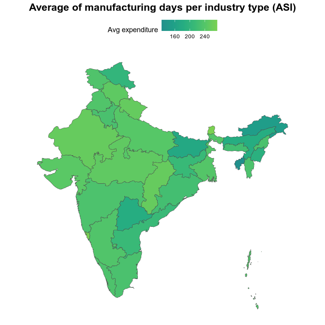

<!-- README.md is generated from README.Rmd. Please edit that file -->

<!-- badges: start -->

[](https://github.com/rahulsh97/asi/actions/workflows/R-CMD-check.yaml)
<!-- badges: end -->

# Annual Survey of Industries (ASI)

The goal of asi is to provide a long dataset of the Annual Survey of
Industries (ASI) from India.

## Example

Install the package from GitHub and load it:

``` r
# install.packages("devtools")
devtools::install_github("rahulsh97/asi")
```

``` r
library(asi)
```

Because of the datasets size, the package provides a function to
download the datasets and create a local DuckDB database. This results
in a CRAN-compliant package.

Here is how to get the ASI database ready for use:

``` r
asi_download()
```

Check the average of manufacturing days per industry type (See
<https://microdata.gov.in/NADA/index.php/catalog/205/data-dictionary/F35?file_name=blkA202223>):

``` r
library(dplyr)
#> 
#> Attaching package: 'dplyr'
#> The following objects are masked from 'package:stats':
#> 
#>     filter, lag
#> The following objects are masked from 'package:base':
#> 
#>     intersect, setdiff, setequal, union
library(duckdb)
#> Loading required package: DBI

con <- dbConnect(duckdb(), asi_file_path())

dbListTables(con)
#>  [1] "2015-16-blkA" "2015-16-blkB" "2015-16-blkC" "2015-16-blkD" "2015-16-blkE"
#>  [6] "2015-16-blkF" "2015-16-blkG" "2015-16-blkH" "2015-16-blkI" "2015-16-blkJ"
#> [11] "2016-17-blkA" "2016-17-blkB" "2016-17-blkC" "2016-17-blkD" "2016-17-blkE"
#> [16] "2016-17-blkF" "2016-17-blkG" "2016-17-blkH" "2016-17-blkI" "2016-17-blkJ"
#> [21] "2017-18-blkA" "2017-18-blkB" "2017-18-blkC" "2017-18-blkD" "2017-18-blkE"
#> [26] "2017-18-blkF" "2017-18-blkG" "2017-18-blkH" "2017-18-blkI" "2017-18-blkJ"
#> [31] "2018-19-blkA" "2018-19-blkB" "2018-19-blkC" "2018-19-blkD" "2018-19-blkE"
#> [36] "2018-19-blkF" "2018-19-blkG" "2018-19-blkH" "2018-19-blkI" "2018-19-blkJ"
#> [41] "2019-20-blkA" "2019-20-blkB" "2019-20-blkC" "2019-20-blkD" "2019-20-blkE"
#> [46] "2019-20-blkF" "2019-20-blkG" "2019-20-blkH" "2019-20-blkI" "2019-20-blkJ"
#> [51] "2020-21-blkA" "2020-21-blkB" "2020-21-blkC" "2020-21-blkD" "2020-21-blkE"
#> [56] "2020-21-blkF" "2020-21-blkG" "2020-21-blkH" "2020-21-blkI" "2020-21-blkJ"
#> [61] "2021-22-blkA" "2021-22-blkB" "2021-22-blkC" "2021-22-blkD" "2021-22-blkE"
#> [66] "2021-22-blkF" "2021-22-blkG" "2021-22-blkH" "2021-22-blkI" "2021-22-blkJ"
#> [71] "2022-23-blkA" "2022-23-blkB" "2022-23-blkC" "2022-23-blkD" "2022-23-blkE"
#> [76] "2022-23-blkF" "2022-23-blkG" "2022-23-blkH" "2022-23-blkI" "2022-23-blkJ"

tbl(con, "2019-20-blkA") %>%
  group_by(a9) %>%
  mutate(
    a9chr = case_when(
      a9 == 1L ~ "Rural",
      a9 == 2L ~ "Urban",
      TRUE ~ as.character(NA)
    )
  ) %>%
  summarise(mwdays = mean(mwdays, na.rm = TRUE)) %>%
  collect()
#> # A tibble: 2 × 2
#>      a9 mwdays
#>   <dbl>  <dbl>
#> 1     2   233.
#> 2     1   226.

dbDisconnect(con, shutdown = TRUE)
```

Create a map showing the average day of manufacturing days per state:

``` r
library(sf)
#> Linking to GEOS 3.13.1, GDAL 3.11.3, PROJ 9.6.0; sf_use_s2() is TRUE
library(ggplot2)

con <- dbConnect(duckdb(), asi_file_path())

dbListTables(con)
#>  [1] "2015-16-blkA" "2015-16-blkB" "2015-16-blkC" "2015-16-blkD" "2015-16-blkE"
#>  [6] "2015-16-blkF" "2015-16-blkG" "2015-16-blkH" "2015-16-blkI" "2015-16-blkJ"
#> [11] "2016-17-blkA" "2016-17-blkB" "2016-17-blkC" "2016-17-blkD" "2016-17-blkE"
#> [16] "2016-17-blkF" "2016-17-blkG" "2016-17-blkH" "2016-17-blkI" "2016-17-blkJ"
#> [21] "2017-18-blkA" "2017-18-blkB" "2017-18-blkC" "2017-18-blkD" "2017-18-blkE"
#> [26] "2017-18-blkF" "2017-18-blkG" "2017-18-blkH" "2017-18-blkI" "2017-18-blkJ"
#> [31] "2018-19-blkA" "2018-19-blkB" "2018-19-blkC" "2018-19-blkD" "2018-19-blkE"
#> [36] "2018-19-blkF" "2018-19-blkG" "2018-19-blkH" "2018-19-blkI" "2018-19-blkJ"
#> [41] "2019-20-blkA" "2019-20-blkB" "2019-20-blkC" "2019-20-blkD" "2019-20-blkE"
#> [46] "2019-20-blkF" "2019-20-blkG" "2019-20-blkH" "2019-20-blkI" "2019-20-blkJ"
#> [51] "2020-21-blkA" "2020-21-blkB" "2020-21-blkC" "2020-21-blkD" "2020-21-blkE"
#> [56] "2020-21-blkF" "2020-21-blkG" "2020-21-blkH" "2020-21-blkI" "2020-21-blkJ"
#> [61] "2021-22-blkA" "2021-22-blkB" "2021-22-blkC" "2021-22-blkD" "2021-22-blkE"
#> [66] "2021-22-blkF" "2021-22-blkG" "2021-22-blkH" "2021-22-blkI" "2021-22-blkJ"
#> [71] "2022-23-blkA" "2022-23-blkB" "2022-23-blkC" "2022-23-blkD" "2022-23-blkE"
#> [76] "2022-23-blkF" "2022-23-blkG" "2022-23-blkH" "2022-23-blkI" "2022-23-blkJ"

# average day of manufacturing days per region
mean_manufacture <- tbl(con, "2019-20-blkA") %>%
  group_by(a7) %>%
  summarise(mwdays = mean(mwdays, na.rm = TRUE)) %>%
  collect()

dbDisconnect(con, shutdown = TRUE)

# merge data with map of India states

india_states <- readRDS("region-codes/india_states_map.rds")

mean_manufacture <- mean_manufacture %>%
  left_join(india_states, by = c("a7" = "state_code"))

ggplot(mean_manufacture) +
  geom_sf(aes(fill = mwdays, geometry = geometry), colour = "grey30", size = 0.2) +
  scale_fill_viridis_c(option = "D", begin = 0.5, end = 0.8, na.value = "grey95", name = "Avg expenditure") +
  labs(title = "Average of manufacturing days per industry type (ASI)") +
  theme_minimal() +
  theme(
    axis.text = element_blank(),
    axis.ticks = element_blank(),
    panel.grid = element_blank(),
    plot.title = element_text(hjust = 0.5, size = 16, face = "bold"),
    legend.position = "top"
  )
```



# Adding older/newer years

1.  Install the Nesstar Explorer (e.g. ASI 2022-23 includes it)
2.  Extract the RAR files downloaded from the microdata website to
    data-raw/202223 or what year you are adding
3.  Export the .Nesstar file to Stata (SAV) format with “Export
    Datasets” and the metadata with “Export DDI” using the Nesstar
    Explorer
4.  Update `00-tidy-data.r` and run it
5.  Update the available datasets in `R/available_datasets.R`
6.  Update the new RDS files in the ‘Releases’ section of the GitHub
    repository
7.  Regenerate the database with `asi_delete()` and `asi_download()`
